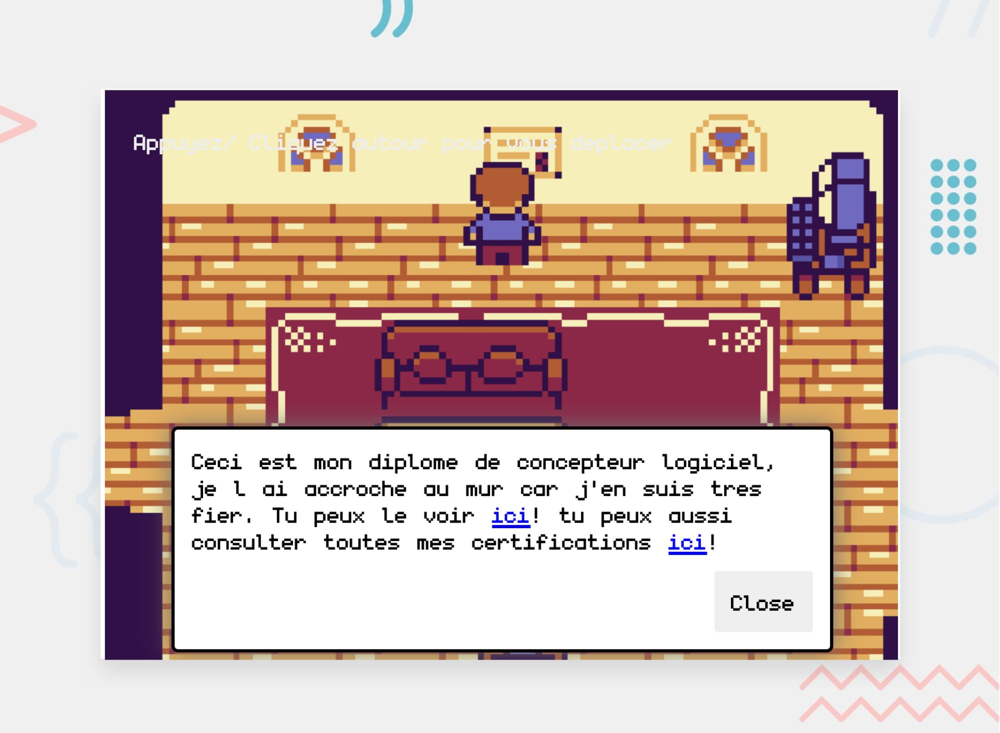

# 2d-portfolio

Welcome to my interactive 2D portfolio! In this unique experience, you can explore a virtual house and discover various elements about my work. As you navigate through the rooms, you’ll find different pieces of information and interactive elements showcasing my projects, skills, and achievements.

The portfolio is fully responsive, ensuring a smooth and engaging experience across devices, from desktop to mobile. Built using JavaScript, it offers an interactive and visually appealing way to learn more about what I do.

Feel free to explore the house, interact with the environment, and get to know my work in a fun and creative way!




## 📦 Installation

To set up the project locally, follow these steps:

1. **Clone the repository**  
   ```bash
   git clone https://github.com/juliengDev/julien-gilbert-portfolio
   cd julien-gilbert-portfolio

2. **Install dependencies**  
   ```bash
   npm install

3. **Start the development server**
   ```bash
   npm run dev

4. **Build for production**
   ```bash
   npm run build

5. **Preview the production build**
   ```bash
   npm run preview